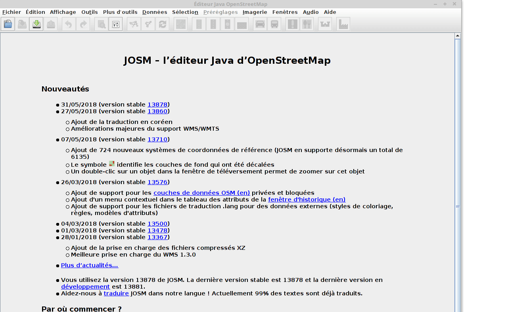
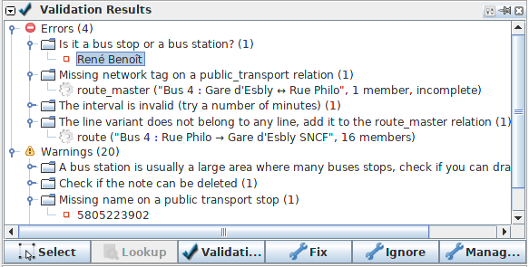

# Jungle Bus – validation ruleset
A set of uncompromising validation rules about public transport in JOSM.

The `errors` are meant to be easy to fix, whereas the `warnings` may need some local knowledge or more advanced public_transport OSM knowledge.

Some of these validation rules are also available in [Osmose](http://osmose.openstreetmap.fr/fr/errors/?item=9014)

To add the ruleset to JOSM:

* Edit -> Preferences
* Validator
* Tag Checker Rules (2nd tab)
* Select "Jungle Bus – validation ruleset"

You may also want to add the pt_assistant plugin, for even more validation rules and other useful tools about OSM public transport.

## Translate

[Help us translate the validation rules in your language !](https://www.transifex.com/openstreetmap-france/osmose/)

## Contribute

Please share your ideas in the issues, and feel free to send a pull request if you know how to implement it in MapCSS.

## About
This validation ruleset has been developed by the [Jungle Bus](http://junglebus.io/) team, as part as the **Bifidus, improve your transit!** project.

If you value this work, show your support by donating to the [OSM French local chapter](http://openstreetmap.fr).

